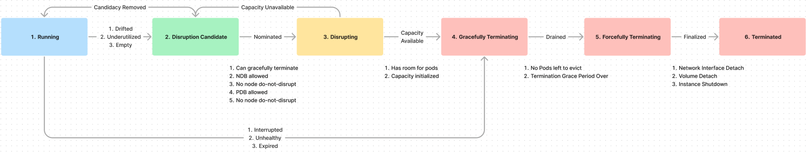
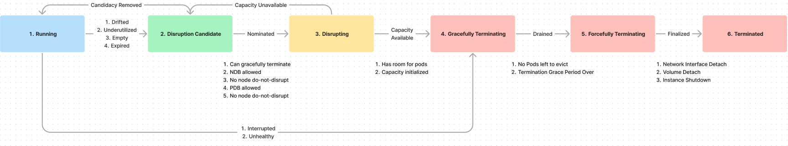

# Forceful Expiration - v0.37+

Users need to enforce a maximum node lifetime to be compliant with security requirements. Cluster administrators that orchestrate Karpenter installations on clusters need a way to enforce this natively within Karpenter. In v0.37 and below, Karpenter respects NDBS, `do-not-disrupt` annotations on nodes, PDBs, `do-not-disrupt` annotations on pods, and waits for pre-spin capacity to initialize before terminating expired nodes. 

This document recommends changing the semantic of expiration so that Karpenter will immediately begin gracefully draining a node once it's expired, regardless of node/pod/availability safeguards, but respect pod `do-not-disrupt` or PDB blocking pods until the node's [TerminationGracePeriod](https://github.com/kubernetes-sigs/karpenter/pull/916) is reached. 

Karpenter needs to change the semantic of Expiration. This document proposes the desired state and what needs to change to get there. 

**Terms**: For the purposes of this document, we’ll call the proposed Expiration as **Forceful** and the current Expiration semantic in Upstream Karpenter today (v0.37) as **Graceful.**

## Proposed Flow - NodeClaim Disruption

**S** = State, **T** = Transitions between states

**T1a (S1 → S2)**: Node gets marked as a Disruption Candidate. This could be for Drift, Underutilization, or Emptiness. Candidate nodes get tainted as `PreferNoSchedule`, so pods prioritize scheduling elsewhere. If a node is un-drifted or becomes utilized, the candidacy is removed **(S2 → S1)**. 

**T1b (S1 → S4):** Karpenter immediately begins gracefully terminating nodes that are interrupted, unhealthy, or expired as soon as they’re detected, without waiting for replacement nodes to initialize before draining pods. 

**T2 (S2 → S3):** Ignoring nodes with blocking NDBs, the `do-not-disrupt` annotation, blocking PDBs, or a `do-not-disrupt` pod, Karpenter will simulate pod rescheduling in the cluster, resulting a list of NodeClaims to create. 
 
**S3:** All Disrupting nodes are tainted as `NoSchedule` to prevent pods from scheduling. Nodes will be marked as Disrupting if necessary capacity for the pods doesn’t initialize within 10 minutes, at which point the taint is removed, and the node goes back to being a Disruption Candidate **(S3 → S2).** All nodes in **S3 through S6** are counted against NDBs, limiting the number of nodes that are nominated **(T2)** for disruption.

**T3 (S3 → S4):** Karpenter waits for necessary capacity in the cluster to be healthy and initialized. Once capacity is available, Karpenter will `kubectl delete` the node(s), tainting the node, beginning graceful termination.

**S4:** Karpenter adds a `NoSchedule` taint and adds an Termination Grace Period Timestamp on the NodeClaim, indicating when Karpenter should transition to Forceful Termination of the node. Karpenter begins draining the node, _respecting PDBs and `do-not-disrupt` pods_. 

***S4** is a point of no return. The node will be terminated within its TGP.* 

**T4 (S4 → S5):** Once the node has no running drainable pods or the TGP timeout is reached, Karpenter directly terminates the underlying instance, initiating forceful termination and cleanup of daemons and networking applications.

**T5 (S5 → S6):** After the termination has been finalized, all network attachments and volumes have been cleaned up, and the node can be removed from the cluster. 

## What’s different in Upstream Karpenter?

Karpenter’s original Expiration semantic was **Forceful**. It was changed to **Graceful** in [this PR](https://github.com/kubernetes-sigs/karpenter/pull/59) so that Karpenter could orchestrate replacement capacity for expired nodes, grouping Expiration with Drift, Underutilization, and Emptiness in **T1**. Users with blocking NDBs, PDBs, or `do-not-disrupt` can prevent expiration from starting, preventing Karpenter from kicking off its TerminationGracePeriod. 

The only difference in the diagram below is Expiration is moved to **T1 (S1 → S2)**.

## 🔑 Adding Forceful Expiration

### Option 1 - Make Expiration Forceful - Recommended

Revert Expiration’s semantic to be **Forceful**, bypassing past NDBs and `do-not-disrupt`, starting graceful termination as soon as nodes are detected as expired. This will still respect PDBs and `do-not-disrupt` pods while draining, and can be timed out when the user sets a `nodePool.TerminationGracePeriod`.

**Pro:** This natively addresses the cluster administrator's use-case without any user configuration. Making this change is easier to reason about before v1, and harder to do after v1. Adding in Graceful Expiration after v1 is easier, as it's less disruptive. 

**Con:** This removes waiting for pre-spun capacity, increasing the chances that pods aren’t able to reschedule when nodes expire, and is a breaking change.

### Option 2 - Allow Forceful and Graceful Expiration

If each NodePool should only represent one type of Expiration, this can be configured as `expirationPolicy: Forceful | Graceful`.  If a NodePool should be able to configure both **Forceful** and **Graceful** Expiration, Karpenter can add `expireAfter: 10d` in addition to `gracefulExpireAfter: 20d`, to represent **Forceful** and **Graceful** Expirations, respectively. 

**Pro:** Allows Upstream Karpenter users to use existing behavior, but changes the default semantic to **Forceful**.

**Con:** More configuration surface, and more concepts of disruption for users to reason about.

### Option 3 - Do Nothing, Require Cluster Admins to Implement Forceful Expiration

If this semantic change is too large to do before v1, we can punt on this and require Cluster Admins to implement **Forceful** Expiration themselves by implementing a controller to watch nodes, making a simple `kubectl delete node` call when a node needs to be cleaned up. 

**Pro:** No changes to the current v1 plan for Upstream Karpenter.

**Con:** Does not include native support for this use-case. 
