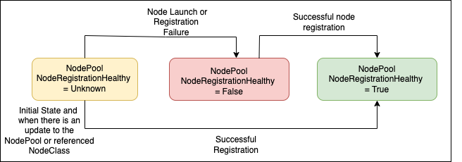
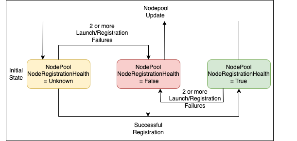

# RFC: NodeRegistrationHealthy Status Condition on NodePool

## Motivation

Karpenter may initiate the creation of nodes based on a NodePool configuration, but these nodes might fail to join the cluster due to unforeseen registration issues that Karpenter cannot anticipate or prevent. An example illustrating this issue is when network connectivity is impeded by incorrect cluster security group configuration, such as missing outbound rule that allows outbound access to any IPv4 address. In such cases, Karpenter will continue its attempts to provision compute resources, but these resources will fail to join the cluster until the outbound rule for the security group is updated. Currently, there isn't a way to surface these kind of failures to the users. 

This RFC proposes enhancing the visibility of these failure modes by introducing a `NodeRegistrationHealthy` status condition on the NodePool. We can then create new metrics around this status condition which will improve observability by alerting cluster administrators to potential issues within a NodePool that require investigation and resolution.

The `NodeRegistrationHealthy` status would specifically highlight instance launch/registration failures that Karpenter cannot fully diagnose or predict. However, this status should not be a mechanism to catch all types of launch/registration failures. Karpenter should not mark resources as `NodeRegistrationHealthy` if it can definitively determine, based on the NodePool/NodeClass configurations or through dry-run, that launch or registration will fail. For instance, if a NodePool is restricted to a specific zone using the `topology.kubernetes.io/zone` label, but the specified zone is not accessible through the provided subnet configurations, this inconsistency shouldn't trigger a `NodeRegistrationHealthy: False` status. CloudProviders should also try implementing deterministic mechanisms to identify launch failures like this [validation controller](https://github.com/aws/karpenter-provider-aws/blob/main/pkg/controllers/nodeclass/validation.go) added for AWS provider.

Currently, while launch and registration processes have defined timeouts, the initialization phase does not. As a result, there's no concept of initialization failures today. However, the proposed design can be extended to potentially incorporate initialization failure detection in future iterations.

## 🔑 Introduce a NodeRegistrationHealthy Status Condition on the NodePool Status

```
// 'NodeRegistrationHealthy' condition indicates if a misconfiguration exists that prevents the normal, successful use of a Karpenter resource
Status:
  Conditions:
    Last Transition Time:  2025-01-13T18:57:20Z
    Message:               
    Observed Generation:   1
    Reason:                NodeRegistrationHealthy
    Status:                True
    Type:                  NodeRegistrationHealthy
```
`NodeRegistrationHealthy` status condition is introduced in the NodePool status which can be set to - 
1. Unknown - When the NodePool is first created, `NodeRegistrationHealthy` is set to Unknown. This means that we don't have enough data to tell if the nodes launched using this NodePool can successfully register or not. 
2. False - NodePool has configuration issues that require user investigation and resolution. Since Karpenter cannot automatically detect these specific launch or registration failures, we will document common failure scenarios and possible fixes in our troubleshooting guide to assist users. The cause for the failure will also be surfaced through the status condition reason and message fields. 
3. True - There has been successful node registration using this unique combination of NodePool and NodeClass spec.

A NodePool marked with `NodeRegistrationHealthy: False` can still be used for provisioning workloads, as this status isn't a precondition for readiness. We can expand this in the future with a follow-up where we will have some cooldown period for trying to schedule with a NodePool that has `NodeRegistrationHealthy: False`. 

## Goals
1. Tolerate transient errors.
2. Respond to corrections in external configuration (i.e. can remove the NodeRegistrationHealthy status condition from a NodePool if an external fix allows Nodes to register).

### Option 1: Track if a node was successfully launched using a NodePool  - Recommended
This option sets `NodeRegistrationHealthy` status condition on the nodePool by checking if the node launched using this nodePool failed to launch/register.



Evaluation conditions -

1. When a nodePool is first created, set `NodeRegistrationHealthy: Unknown`. A nodePool which already has `NodeRegistrationHealthy: True` will not go back to unknown unless there is an update to the NodePool or the referenced nodeClass.
2. On a failed launch/registration, set `NodeRegistrationHealthy: False`. Do not update the status condition to false if the nodePool already has `NodeRegistrationHealthy: True`.
3. On successful registration, set `NodeRegistrationHealthy: True`.
4. Do not update the `NodeRegistrationHealthy` status condition when Karpenter restarts.

#### Considerations

1. 👍 This approach is particularly helpful for pod binding/ready metrics for pods that are scheduled against NodePools that have `NodeRegistrationHealthy: True`. Metrics collection will begin only after its first successful node registration. Once `NodeRegistrationHealthy: True`, and a node is launched with a bad AMI then we will still see pod metrics that can help identify node launch failures due to bad AMIs.

### Option 2: In-memory Buffer to store history

This option will have an in-memory FIFO buffer, which will grow to a max size of 10 (this can be changed later). This buffer will store data about the success or failure during launch/registration and is evaluated by a controller to determine the relative health of the NodePool. This would be implemented as a `[]bool`, where `true` indicates a launch success, and `false` represents a failure. The state of the `NodeRegistrationHealthy` condition would be based on the number of `false` entries in the buffer.



Evaluation conditions -

1. We start with an empty buffer with `NodeRegistrationHealthy: Unknown`.
2. There have to be 2 minimum failures in the buffer for `NodeRegistrationHealthy` to transition to `False`. 
3. If the buffer starts with a success then `NodeRegistrationHealthy: True`. 
4. If Karpenter restarts then we flush the buffer but don't change the existing state of `NodeRegistrationHealthy` status condition.
5. If there is an update to a Nodepool/Nodeclass, flush the buffer and set `NodeRegistrationHealthy: Unknown`.
6. Since the buffer is FIFO, we remove the oldest launch result when the max buffer size is reached.
7. If no new launches/registrations happen for 2 consecutive registration ttl cycles (currently 15 minutes), expire/remove the oldest entry in the buffer and revaluate the status condition if it was previously set to False. This ensures that a NodePool's unhealthy status does not persist indefinitely when no new launch attempts have occurred within 30 minutes.

See below for example evaluations:

```
Successful Launch: true
Unsuccessful Launch: false

[] = 'NodeRegistrationHealthy: Unknown'
[true] = 'NodeRegistrationHealthy: True'
[false, true] = 'NodeRegistrationHealthy: True'
[false, false] = 'NodeRegistrationHealthy: False'
[false, true, false] = 'NodeRegistrationHealthy: False'
[false, true, true, true, true, true, true, true, true, true] = 'NodeRegistrationHealthy: True'
```

#### Considerations

1. 👍 Tolerates transient failures such as those that happen due to underlying hardware failure because we keep track of recent launch history and set `NodeRegistrationHealthy: True` only when there are 2 or more launch/registration failures.
2. 👍 Can be easily expanded if we want to update the buffer size depending on the cluster size.
3. 👎 This approach tends to get more complex as we need to scale with the cluster size.
4. 👎 Managing buffer entry expiration adds another layer of complexity. We need to ensure that a NodePool's unhealthy status doesn't persist indefinitely when no new launch attempts have occurred within a specified timeframe.

### How Does this Improve Observability?
The introduction of `NodeRegistrationHealthy` status condition serves two key purposes:

1. It provides users with clearer visibility into NodeClaim launch and registration failures. 
2. It establishes groundwork for future scheduling optimizations, where we can assign lower priority to NodePools marked with `NodeRegistrationHealthy: False`.
