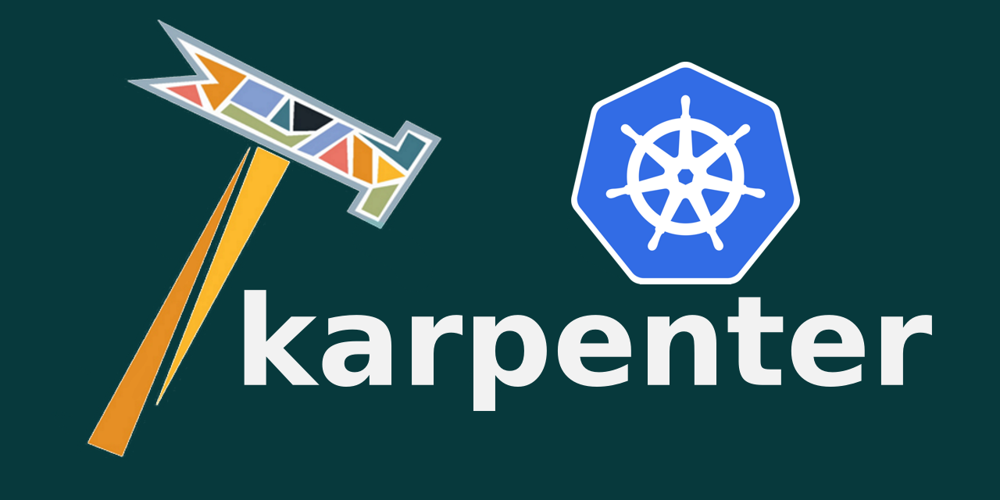

Karpenter is a node autoscaler built for Kubernetes and can run in any Kubernetes cluster anywhere.

This is an early stage, experimental project built with ❤️ and is available as a **developer preview**. We're excited you are here - jump in, let us know what you think. We welcome contributions.
## Installation
Follow the setup recommendations of your cloud provider.
- [AWS](docs/aws/README.md)

### Quick Install - Controller + Dependencies
```
sh -c "$(curl -fsSL https://raw.githubusercontent.com/awslabs/karpenter/v0.1.2/hack/quick-install.sh)"
```

### Kubectl - Standalone
```
kubectl apply -f https://raw.githubusercontent.com/awslabs/karpenter/v0.1.2/releases/aws/manifest.yaml
```

### Helm - Standalone
```
helm repo add karpenter https://awslabs.github.io/karpenter/charts
helm install karpenter karpenter/karpenter
```

## Docs
- [Examples](docs/examples)
- [Working Group](docs/working-group)
- [Developer Guide](docs/DEVELOPER_GUIDE.md)
- [Design](docs/designs/DESIGN.md)
- [FAQs](docs/FAQs.md)
- [Contributing](docs/CONTRIBUTING.md)

## Terms
Karpenter is an early stage, experimental project that is currently maintained by AWS and available as a preview. We request that you do not use Karpenter for production workloads at this time. See details in our [terms](docs/TERMS.md).

## License
This project is licensed under the Apache-2.0 License.
