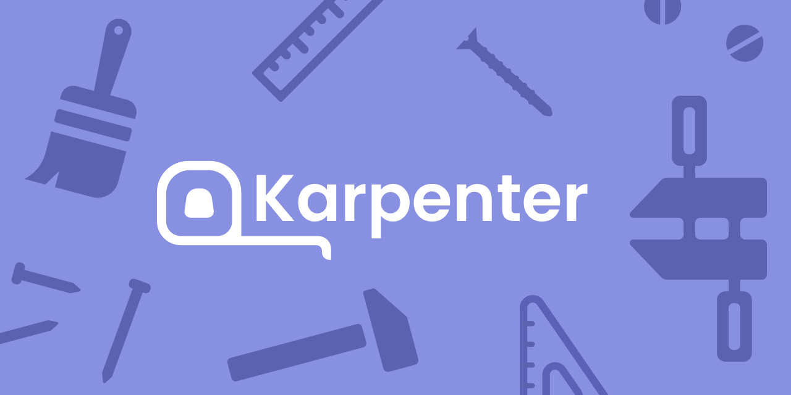

Karpenter is an open-source node provisioning project built for Kubernetes.
Karpenter improves the efficiency and cost of running workloads on Kubernetes clusters by:

* **Watching** for pods that the Kubernetes scheduler has marked as unschedulable
* **Evaluating** scheduling constraints (resource requests, nodeselectors, affinities, tolerations, and topology spread constraints) requested by the pods
* **Provisioning** nodes that meet the requirements of the pods
* **Removing** the nodes when the nodes are no longer needed

Come discuss Karpenter in the [#karpenter](https://kubernetes.slack.com/archives/C02SFFZSA2K) channel, in the [Kubernetes slack](https://slack.k8s.io/) or join the [Karpenter working group](https://karpenter.sh/docs/contributing/community-meetings/#working-group-meetings) bi-weekly calls. If you want to contribute to the Karpenter project, please refer to the Karpenter docs.

Check out the [Docs](https://karpenter.sh/docs/) to learn more.

## Talks
- 03/19/2024 [Harnessing Karpenter: Transforming Kubernetes Clusters with Argo Workflows](https://www.youtube.com/watch?v=rq57liGu0H4)
- 12/04/2023 [AWS re:Invent 2023 - Harness the power of Karpenter to scale, optimize & upgrade Kubernetes](https://www.youtube.com/watch?v=lkg_9ETHeks)
- 09/08/2022 [Workload Consolidation with Karpenter](https://youtu.be/BnksdJ3oOEs)
- 05/19/2022 [Scaling K8s Nodes Without Breaking the Bank or Your Sanity](https://www.youtube.com/watch?v=UBb8wbfSc34)
- 03/25/2022 [Karpenter @ AWS Community Day 2022](https://youtu.be/sxDtmzbNHwE?t=3931)
- 12/20/2021 [How To Auto-Scale Kubernetes Clusters With Karpenter](https://youtu.be/C-2v7HT-uSA)
- 11/30/2021 [Karpenter vs Kubernetes Cluster Autoscaler](https://youtu.be/3QsVRHVdOnM)
- 11/19/2021 [Karpenter @ Container Day](https://youtu.be/qxWJRUF6JJc)
- 05/14/2021 [Groupless Autoscaling with Karpenter @ Kubecon](https://www.youtube.com/watch?v=43g8uPohTgc)
- 05/04/2021 [Karpenter @ Container Day](https://youtu.be/MZ-4HzOC_ac?t=7137)
