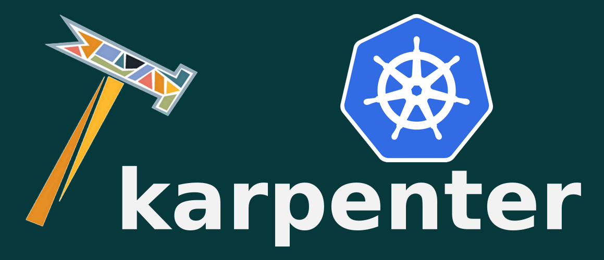

Karpenter is a node lifecycle management solution. It observes incoming pods and launches the right instances for the situation. Instance selection decisions are intent based and driven by the specification of incoming pods, including resource requests and scheduling constraints.

It's responsible for:
- **Launching** nodes for unschedulable pods
- **Replacing** existing nodes to improve resource utilization
- **Terminating** nodes if outdated or no longer needed
- **Draining** nodes gracefully before preemption

For most use cases, the entirety of a cluster’s capacity can be managed by a single Karpenter [Provisioner](README.md). Availability zone, instance type, capacity type, machine image, and scheduling constraints are automatically determined by the controller using a combination of defaults and overrides. Additionally, you can define multiple Provisioners, enabling use cases like isolation, entitlements, and sharding.

Karpenter optimizes for scheduling latency and utilization efficiency using two complementary control loops. First, is the allocator, a fast-acting latency-sensitive controller responsible for ensuring that incoming pods are scheduled as quickly as possible. Second, is the reallocator, a slow-acting cost-sensitive controller that replaces nodes as pods requests and capacity prices shift over time. Together, they maximize the availability and efficiency of your cluster.

Come discuss Karpenter in the [#provider-aws channel](https://kubernetes.slack.com/archives/C0LRMHZ1T) in the [Kubernetes slack](https://slack.k8s.io/)!

*Note: Reallocation is still in development. Check out the [FAQs](FAQs.md) and [Roadmap](ROADMAP.md) to learn more.*

## Installation

Follow the setup recommendations of your cloud provider.
- [AWS](pkg/cloudprovider/aws/docs)

> ❗ Note: There may be backwards incompatible changes between versions when upgrading before v0.3.0. Karpenter follows [Kubernetes versioning guidelines](https://kubernetes.io/docs/concepts/overview/kubernetes-api/#api-changes). Before upgrading, we recommend:
> - Check the [release notes](https://github.com/awslabs/karpenter/releases)
> - Uninstall Karpenter
> - Remove all nodes launched by karpenter
> - Reinstall Karpenter

## References
- [Docs](https://awslabs.github.io/karpenter/docs)
- [API](README.md)
- [FAQs](FAQs.md)
- [Roadmap](ROADMAP.md)
- [Working Group](WORKING_GROUP.md)
- [Developer Guide](DEVELOPER_GUIDE.md)
- [Contributing](CONTRIBUTING.md)

## Talks
- [Karpenter @ Container Day, May 2021](https://www.twitch.tv/videos/1010593737?t=141m50s)
- [Groupless Autoscaling with Karpenter @ Kubecon, May 2021](https://www.youtube.com/watch?v=43g8uPohTgc)

## License
This project is licensed under the Apache-2.0 License.
