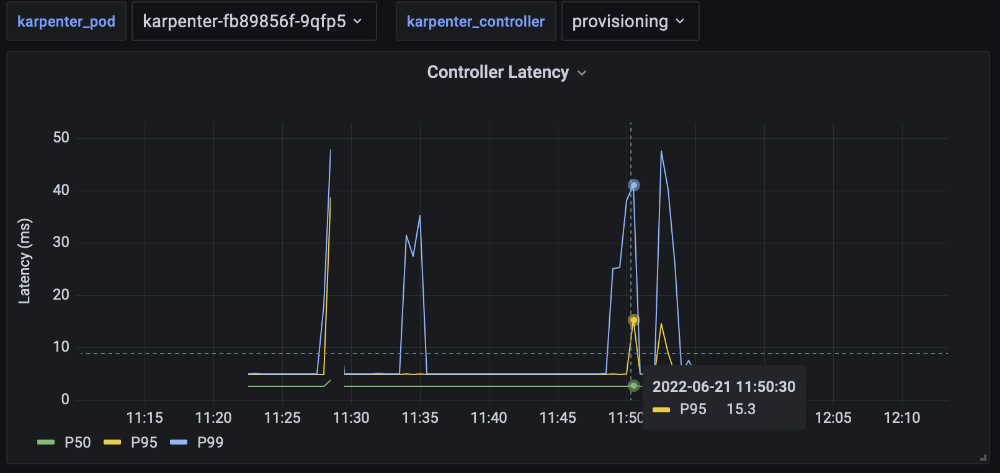
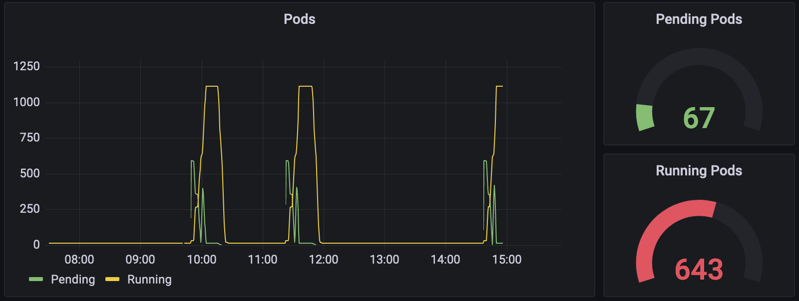
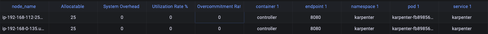

# Karpenter Metrics / Dashboard Design

## Motivation

While Karpenter already instruments several Prometheus metrics ([existing
metrics](#existing-metrics)), consumers have expressed interest in expanding the available metrics
(exemplified by this [github issue](https://github.com/aws/karpenter/issues/612)). Additionally, an expanded set of
metrics would aid in debugging [baselining issues](https://github.com/aws/karpenter/issues/1639). Finally, expanding the
set of metrics will bring feature-parity with other cluster auto-scaling solutions (e.g. [CAS'
metrics](https://github.com/kubernetes/autoscaler/blob/master/cluster-autoscaler/proposals/metrics.md)).

## Goals

Dashboards will be targeted toward two types of users: those looking for detailed information on the performance like
developers and contributors, and those looking to evaluate Karpenter at a high-level, without requiring deep domain
knowledge of Karpenter.

For high-level metrics, users will be able to:
- View object distribution across various attributes (e.g. provisioner, capacity types, instance types, etc.)
- Evaluate utilization of objects provisioned by Karpenter

For more in-depth metrics, users will be able to:
- View various latencies, error rates, and execution rates of individual controllers and API calls
- Evaluate scheduling statistics (e.g. node termination, and pod startup durations)

## Karpenter Capacity Dashboard

The Karpenter Capacity dashboard serves as the high-level dashboard which describes object distribution and utilization.

To demonstrate object distribution, Grafana graphs / bar gauges will be used to demonstrate distribution of nodes and
pods over various labels, including provisioner, zone, architecture, instance type, and capacity type. The phase of pods
and nodes will also be demonstrated in a similar way. Finally, gauges and line graphs will be used to demonstrate
overall system resources (e.g. total memory in the cluster).

As for utilization, gauges will show the current resource requests and resource utilization rates. Additionally, there
will be a line graph to show overall resource utilization over time. Finally, there will be a table showing per-node
utilization. All utilization metrics will be separated by available resource types (e.g. cpu, memory, pods, etc).

The following metrics will be instrumented to achieve these goals:

| **Name**                                | **Type**  | **Labels**                                                                                             | **Description**
|-----------------------------------------|-----------|--------------------------------------------------------------------------------------------------------|--------------------------------------------------------------
| `karpenter_nodes_count`                 | Gauge     | `provisioner`, `zone`, `arch`, `capacity_type`, `instance_type`, `phase`                               | The number of nodes provisioned by Karpenter.
| `karpenter_pods_count`                  | Gauge     | `provisioner`, `zone`, `arch`, `capacity_type`, `instance_type`, `phase`, `node_name`, `schedulable`   | The number of pods scheduled to Karpenter provisioned nodes.
| `karpenter_nodes_allocatable`           | Gauge     | `resource_type`, `node_name`, `provisioner`, `zone`, `arch`, `capacity_type`, `instance_type`, `phase` | The resources allocatable by nodes
| `karpenter_nodes_total_daemon_limits`   | Gauge     | `resource_type`, `node_name`, `provisioner`, `zone`, `arch`, `capacity_type`, `instance_type`, `phase` | The resources specified by DaemonSet pod limits
| `karpenter_nodes_total_daemon_requests` | Gauge     | `resource_type`, `node_name`, `provisioner`, `zone`, `arch`, `capacity_type`, `instance_type`, `phase` | The resources requested by DaemonSet pods bound to nodes
| `karpenter_nodes_total_pod_limits`      | Gauge     | `resource_type`, `node_name`, `provisioner`, `zone`, `arch`, `capacity_type`, `instance_type`, `phase` | The resources specified by non-DaemonSet pod limits
| `karpenter_nodes_total_pod_requests`    | Gauge     | `resource_type`, `node_name`, `provisioner`, `zone`, `arch`, `capacity_type`, `instance_type`, `phase` | The resources requested by non-DaemonSet pods bound to nodes
| `karpenter_provisioner_limit`           | Gauge     | `resource_type`, `provisioner_name`                                                                    | The specified limits on the provisioner
| `karpenter_provisioner_usage`           | Gauge     | `resource_type`, `provisioner_name`                                                                    | The amount of resources that have been provisioned

## Karpenter Performance Dashboard

The performance dashboard exists to give developers and contributors more detailed information. To do so it will
demonstrate statistics for individual [controllers](https://github.com/aws/karpenter/tree/main/pkg/controllers),
scheduling, and API usage.

Individual controller performance will be visualized in two ways: reconcile latency and reconcile rate. Reconcile
latency will be visualized as a Grafana line graph which shows the p0, p50, p90, p99, and p100 latency over time.
Similarly, reconcile rate, or the number of reconciliations per second, will be graphed over time. Each of these graphs
will be filterable by controller. The metrics required to implement these are already instrumented by the
controller-runtime.

| **Name**                                     | **Type**  | **Labels**   | **Description**
|----------------------------------------------|-----------|--------------|------------------------------------------------------
| `controller_runtime_reconcile_errors_total`  | Counter   | `controller` | Total number of reconciliation errors per controller
| `controller_runtime_reconcile_time_seconds`  | Histogram | `controller` | Length of time per reconciliation per controller
| `controller_runtime_reconcile_total`         | Counter   | `controller` | Total number of reconciliations per controller

Scheduling statistics consist of actions not representable by a single controller reconciliation, such as node
termination and pod startup. The visualizations will be the same as those for individual controller performance. The
following metrics will be instrumented to implement these visualizations:

| Name                                                   | Type      | Labels | Description                                        |
|--------------------------------------------------------|-----------|--------|----------------------------------------------------|
| `karpenter_nodes_termination_time_seconds`             | Summary   | None   | [Measurement Definitions](#measurement-definitions) | 
| `karpenter_pods_startup_time_seconds`                  | Summary   | None   | [Measurement Definitions](#measurement-definitions) |

API statistics will consist of API call latency, call rate, call method, return code, and payload size. These statistics will be
separated into Kubernetes API and cloudprovider API statistics. Call latency and call rate will be represented the same
as those for the individual controllers. Finally, payload size will be a histogram of payload sizes. All of these
visualizations can be filtered by call method and return code. The following metrics will be instrumented to implement
these visualizations.

| **Name**                                          | **Type** | **Labels**               | **Description**                                                |
|---------------------------------------------------|----------|--------------------------|----------------------------------------------------------------|
| `karpenter_kube_api_time_seconds`                 | Summary  | `object`, `verb`, `code` | The duration of a call the API server                          |
| `karpenter_kube_api_payload_total_bytes`          | Gauge    | `object`, `verb`, `code` | The total payload size transferred to/from the API server      |
| `karpenter_cloudprovider_api_time_seconds`        | Summary  | `verb`, `code`           | The duration of an API call to a cloudprovider                 |
| `karpenter_cloudprovider_api_payload_total_bytes` | Gauge    | `verb`, `code`           | The total payload size transferred to/from a cloudprovider API |

## Implementation Considerations

### Histogram vs Summary

In Prometheus, histograms and summaries often play similar roles. Both are frequently used to keep track of quantiles
(e.g. p99 latency). Although histograms are simpler to implement and require less computation on the side instrumenting
the metrics, they are not without their faults. Histograms track a set of buckets, where each bucket is a counter which
represents the number of occurrences that were less than that buckets value. Since the buckets are a fixed range,
histograms are a poor choice for unbounded data. Summaries instead directly track quantiles. This involves more
computation but works better for unbounded data.

Prometheus `Summary` metric types compute running quantiles for a given metric for given label values. Unlike 
histograms, summaries cannot be aggregated since it can result in statistically non-sensical results. Theoretically,
summaries can be tracked for many labels, but we would need a number of summary metrics equal to the size of the 
cartesian product of all the labels, which is not viable.

### Cluster State

The metrics used by the cluster capacity dashboard will not be populated by continuously polling objects in the cluster,
but will instead be based on Karpenter's internal cluster state representation. As objects are updated there, their
corresponding metrics will also be updated. By doing this, additional controllers will not be required reducing
computation and network load.

### API Monitoring

As API calls are made through client APIs, measuring them directly in Karpenter is difficult. Depending on the API,
there are solutions. For example, the AWS SDK supports custom HTTP clients. An alternate approach would be to implement
a proxy which Karpenter makes API calls through.

## Appendix

### Prometheus Concepts

#### Metric Types

The Prometheus API has four metric types: **counters**, **gauges**, **histograms**, and **summaries**. Counters and gauges
represent one value. Counters are monotonically increasing values and gauges have no restrictions. Histograms and
summaries are constructed from a series of counters to represent broader information trends.

#### Metrics Model

Applications which export prometheus metrics will expose an http endpoint, typically called `metrics`. This endpoint
contains a list of metrics and their **current** values (each application does not store a history of the metric).
Prometheus then polls those endpoints at fixed intervals, appending the current value of the metrics to a history stored
by Prometheus. These time-series can then be processed using PromQL in applications such as Grafana.

#### PromQL

PromQL is Prometheus’ integrated query language. It provides functionality such as label filtering with regex and metric
aggregation with keywords such as sum, median, min, and max.

### Grafana Concepts

Grafana integrates with Prometheus, among other sources, to aggregate metrics into visualizations.

#### Visualizations

A Grafana visualization is used to visualize PromQL queries. The following are some widgets that will be used in
Karpenter's dashboards:

| **Visualization**                                                                    | **Description**                                                                               |
|--------------------------------------------------------------------------------------|-----------------------------------------------------------------------------------------------|
| [Bar Gauge](https://grafana.com/docs/grafana/latest/visualizations/bar-gauge-panel/) | Shows one or more gauges reducing each field to a single value. Displayed as parallel bars.   |
| [Candlestick](https://grafana.com/docs/grafana/latest/visualizations/candlestick/)   | A time series of box and whisker plots                                                        |
| [Gauge](https://grafana.com/docs/grafana/latest/visualizations/gauge-panel/)         | Shows one or more gauges reducing each field to a single value. Displayed as circular gauges. |
| [Histogram](https://grafana.com/docs/grafana/latest/visualizations/histogram/)       | A bar graph representing the distribution of values                                           |
| [Table](https://grafana.com/docs/grafana/latest/visualizations/table/)               | A table consisting of rows and columns with various data fields                               |
| [Time Series](https://grafana.com/docs/grafana/latest/visualizations/time-series/)   | Any visualization which represents the change in data over time (e.g. line graphs)            |

The following are some sample visualizations:

Percentile Line Graph

Pod Summary

Node Utilization Table

#### Dashboards

Dashboards consist of a collection of widgets. What makes dashboards powerful is the ability to apply global
configuration across all widgets in a dashboard. Applications of this include selecting the same time window across all
widgets and selecting label values.

#### Vending

Grafana dashboards are vended as JSON objects. Currently users can import dashboards from [Grafana's
website](https://grafana.com/grafana/dashboards/16237) or through the Grafana Helm chart with a [custom values
file](https://github.com/aws/karpenter/blob/main/website/content/en/v0.12.0/getting-started/getting-started-with-karpenter/grafana-values.yaml).

### Measurement Definitions

**Pod Startup Latency:** Measures the time in seconds from the pod being created until the pod is ready.

**Node Termination Latency:** Measures the time from an initial node termination request until the node object is
deleted. This differs from the termination controller latency since multiple reconciles may be required to terminate the
node.

### Master List of Proposed Metrics

| **Name**                                          | **Type**  | **Labels**                                                                                             | **Description**
|---------------------------------------------------|-----------|--------------------------------------------------------------------------------------------------------|--------------------------------------------------------------
| `karpenter_nodes_count`                           | Gauge     | `provisioner`, `zone`, `arch`, `capacity_type`, `instance_type`, `phase`                               | The number of nodes provisioned by Karpenter.
| `karpenter_pods_count`                            | Gauge     | `provisioner`, `zone`, `arch`, `capacity_type`, `instance_type`, `phase`, `node_name`, `schedulable`   | The number of pods scheduled to Karpenter provisioned nodes.
| `karpenter_nodes_allocatable`                     | Gauge     | `resource_type`, `node_name`, `provisioner`, `zone`, `arch`, `capacity_type`, `instance_type`, `phase` | The resources allocatable by nodes
| `karpenter_nodes_total_daemon_limits`             | Gauge     | `resource_type`, `node_name`, `provisioner`, `zone`, `arch`, `capacity_type`, `instance_type`, `phase` | The resources specified by DaemonSet pod limits
| `karpenter_nodes_total_daemon_requests`           | Gauge     | `resource_type`, `node_name`, `provisioner`, `zone`, `arch`, `capacity_type`, `instance_type`, `phase` | The resources requested by DaemonSet pods bound to nodes
| `karpenter_nodes_total_pod_limits`                | Gauge     | `resource_type`, `node_name`, `provisioner`, `zone`, `arch`, `capacity_type`, `instance_type`, `phase` | The resources specified by non-DaemonSet pod limits
| `karpenter_nodes_total_pod_requests`              | Gauge     | `resource_type`, `node_name`, `provisioner`, `zone`, `arch`, `capacity_type`, `instance_type`, `phase` | The resources requested by non-DaemonSet pods bound to nodes
| `karpenter_provisioner_limit`                     | Gauge     | `resource_type`, `provisioner_name`                                                                    | The specified limits on the provisioner
| `karpenter_provisioner_usage`                     | Gauge     | `resource_type`, `provisioner_name`                                                                    | The amount of resources that have been provisioned
| `controller_runtime_reconcile_errors_total`       | Counter   | `controller`                                                                                           | Total number of reconciliation errors per controller
| `controller_runtime_reconcile_time_seconds`       | Histogram | `controller`                                                                                           | Length of time per reconciliation per controller
| `controller_runtime_reconcile_total`              | Counter   | `controller`                                                                                           | Total number of reconciliations per controller
| `karpenter_nodes_termination_time_seconds`        | Summary   | None                                                                                                   | [Measurement Definitions](#measurement-definitions)
| `karpenter_pods_startup_time_seconds`             | Summary   | None                                                                                                   | [Measurement Definitions](#measurement-definitions)
| `karpenter_kube_api_time_seconds`                 | Summary   | `object`, `verb`, `code`                                                                               | The duration of a call the API server
| `karpenter_kube_api_payload_total_bytes`          | Gauge     | `object`, `verb`, `code`                                                                               | The total payload size transferred to/from the API server
| `karpenter_cloudprovider_api_time_seconds`        | Summary   | `verb`, `code`                                                                                         | The duration of an API call to a cloudprovider
| `karpenter_cloudprovider_api_payload_total_bytes` | Gauge     | `verb`, `code`                                                                                         | The total payload size transferred to/from a cloudprovider API

### Existing Metrics

| **Name**                                                      | **Type**  | **Labels**                                                                                                     | **Description**
|---------------------------------------------------------------|-----------|----------------------------------------------------------------------------------------------------------------|------------------------------------------------------------------------------------------------------------------
| `karpenter_provisioner_limit`                                 | Gauge     | `resourceType`, `provisionerName`                                                                              | The specified limits on the provisioner
| `karpenter_provisioner_usage`                                 | Gauge     | `resourceType`, `provisionerName`                                                                              | The amount of resources that have been provisioned
| `karpenter_provisioner_usage_pct`                             | Gauge     | `resourceType`, `provisionerName`                                                                              | The percentage of each resource used based on the resources provisioned and the limits that have been configured
| `karpenter_nodes_allocatable`                                 | Gauge     | `resource_type`, `node_name`, `provisioner`, `zone`, `arch`, `capacity_type`, `instance_type`, `phase`         | The resources allocatable by nodes
| `karpenter_nodes_system_overhead`                             | Gauge     | `resource_type`, `node_name`, `provisioner`, `zone`, `arch`, `capacity_type`, `instance_type`, `phase`         | The difference between the node's capacity and allocatable values
| `karpenter_nodes_total_daemon_limits`                         | Gauge     | `resource_type`, `node_name`, `provisioner`, `zone`, `arch`, `capacity_type`, `instance_type`, `phase`         | The resources specified by DaemonSet pod limits
| `karpenter_nodes_total_daemon_requests`                       | Gauge     | `resource_type`, `node_name`, `provisioner`, `zone`, `arch`, `capacity_type`, `instance_type`, `phase`         | The resources requested by DaemonSet pods bound to nodes
| `karpenter_nodes_total_pod_limits`                            | Gauge     | `resource_type`, `node_name`, `provisioner`, `zone`, `arch`, `capacity_type`, `instance_type`, `phase`         | The resources specified by non-DaemonSet pod limits
| `karpenter_nodes_total_pod_requests`                          | Gauge     | `resource_type`, `node_name`, `provisioner`, `zone`, `arch`, `capacity_type`, `instance_type`, `phase`         | The resources requested by non-DaemonSet pods bound to nodes
| `karpenter_pods_state`                                        | Gauge     | `name`, `namespace`, `owner`, `node`, `provisioner`, `zone`, `arch`, `capacity_type`, `instance_type`, `phase` | The current state of the pods
| `karpenter_cloudprovider_duration_seconds`                    | Histogram | `controller`, `method`, `provider`                                                                             | Duration of cloud provider method calls in seconds
| `karpenter_allocation_controller_scheduling_duration_seconds` | Histogram | `provisioner`                                                                                                  | Duration of the scheduling process in seconds
| `controller_runtime_active_workers`                           | Gauge     | `controller`                                                                                                   | Number of currently used workers per controller
| `controller_runtime_max_concurrent_reconciles`                | Gauge     | `controller`                                                                                                   | Maximum number of concurrent reconciles per controller
| `controller_runtime_reconcile_errors_total`                   | Counter   | `controller`                                                                                                   | Total number of reconciliation errors per controller
| `controller_runtime_reconcile_time_seconds`                   | Histogram | `controller`                                                                                                   | Length of time per reconciliation per controller
| `controller_runtime_reconcile_total`                          | Counter   | `controller`                                                                                                   | Total number of reconciliations per controller
| `workqueue_adds_total`                                        | Counter   | `name`                                                                                                         | Total number of adds handled by workqueue
| `workqueue_depth`                                             | Gauge     | `name`                                                                                                         | Current depth of workqueue
| `workqueue_longest_running_processor_seconds`                 | Gauge     | `name`                                                                                                         | How many seconds has the longest running processor for workqueue been running
| `workqueue_queue_duration_seconds`                            | Histogram | `name`                                                                                                         | How long in seconds an item stays in the workqueue before being requested
| `workqueue_retries_total`                                     | Counter   | `name`                                                                                                         | Total number of retries handled by workqueue
| `workqueue_unfinished_work_seconds`                           | Gauge     | `name`                                                                                                         | How many seconds of work has been done that is in progress and hasn't been observed by work_duration.
| `workqueue_work_duration_seconds`                             | Histogram | `name`                                                                                                         | How long in seconds processing an item from workqueue takes
