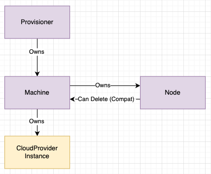

# Karpenter Node Ownership

_Provisioning is used throughout this doc to reference Karpenter scheduling and spinning up a node. This can apply to both the pending pod scheduling loop and also the consolidation scheduling loop. Essentially, any scheduling loop where Karpenter launches nodes._

## 🔑  Summary

Karpenter’s current node creation logic causes consistency issues as well as race conditions that lead to leaked instances and reduced node launch performance. With these changes, Karpenter will no longer create nodes, and instead allow the Kubelet and cloud controller managers to register and deregister the Node with the apiserver. As a result, Karpenter needs a new way to model in flight capacity: instances that have been launched, but have not yet been registered as a Node.

The recommendation is that this in-flight capacity should be modeled as an internal Machine CR that represents a Karpenter provisioner/consolidation scheduling decision. This has the following benefits:

1. Karpenter stops creating the Node object, avoiding race conditions and conflicts with the kube-apiserver and the kubelet that are causing orphaned nodes and instances
2. Karpenter does not need to know the node name at the end of its provisioning loop, shortening the provisioning loop for clouds that do not know the node name at instance launch time
3. Karpenter ensures that provisioners own Machines and that this ownership can be reflected at creation time. This ensures that Machines and Nodes aren't unintentionally orphaned when provisioners are deleted.
5. Karpenter makes its in-flight capacity observable to users through well-known Kubernetes APIs

_Note: This internal Machine CR will come in as an alpha API and an internal design detail and should __not__ be relied upon for any dependent tooling until the API is stable._

## Background

Karpenter currently creates the node object on the Kubernetes api server immediately after creating the VM instance. Kubernetes cloud providers (EKS, AKS, GKE, etc.) assume that, ultimately, the kubelet will be the entity responsible for registering the node to the api-server. This is reflected [through the userData](https://github.com/awslabs/amazon-eks-ami/blob/master/files/bootstrap.sh) where KubeletConfig can be set [that is only properly propagated for all values when the kubelet is the node creator](https://github.com/kubernetes/kubernetes/blob/39c76ba2edeadb84a115cc3fbd9204a2177f1c28/pkg/kubelet/kubelet_node_status.go#L286). However, Karpenter’s current architecture necessitates that it both launches the VM instance and creates the node object on the Kubernetes API server in succession (more on this [below](#why-does-karpenter-createoperate-on-the-node-at-all)).

This document describes the current node creation flow for Karpenter as well as the rationale for why Karpenter originally created the node object. It then calls out the specific problems with this approach and recommends an alternative approach to creating the Node object that solves for the current approach’s problems.

### Current Instance & Node Creation Flow

Karpenter currently performs the following operations when it detect pending pods and launches capacity to the cluster:

1. Performs a **CreateFleet** request against EC2 APIs which leads to VM Instance Creation
2. Performs a **Create** against the `/core/v1/node` Kubernetes API
   1. If there is a conflict in this **Create** call to the Node object, Karpenter assumes that Kubelet already created the node and does not add the Karpenter-managed node labels onto the node
3. **Reconciles** the Node termination finalizer onto the node as soon as the node watch receives an Add/Update event for the node
4. **Reconciles** the Provisioner ownerReference onto the node as soon as the node watch receives an Add/Update event for the node

### Why does Karpenter create/operate on the node at all?

Karpenter creates and operates on a node for a few core reasons:

1. The Karpenter provisioner needs to be aware of the in-flight capacity before proceeding to provision additional capacity.
2. Karpenter controllers need to be able to add a finalizer to a node so that they can handle the cordon, drain, and delete orchestration initiated on a `kubectl node delete` (or similar)
3. Karpenter controllers need to communicate an owner relationship from the Provisioner → Node such that when a Provisioner is removed from the cluster, all Nodes provisioned on behalf of it will also be removed. In practice, this looks like Karpenter reconciling a Provisioner ownerReference onto the node.

#### What is in-flight capacity?

Karpenter considers in-flight capacity to be VM instances that we have launched but do not yet have a known exact allocatable capacity reported by the kubelet. When Karpenter launches VM instances and creates the node object, it considers that node to be in-flight (with approximated allocatable resources based on the GetInstanceTypes()) call until the kubelet has registered the allocatable resources to that node.

### What if we just stopped creating the node outright?

Removing node creation outright has two major problems: Provisioner loop synchronization and Node Reconciliation

#### Provisioner Loop Synchronization

Without in-flight capacity modeling and approximations, Karpenter would have to wait for all instances that it launched to be registered and to report their allocatable capacity before continuing on to the next round of provisioning for pending pods. In practicality, this process of waiting is far too slow (40s+) and requires synchronization between the Karpenter provisioning loop and the node registration.

We can get around waiting and get closer to a better solution here by modeling in-flight capacity in some way (e.g. storing nodes in memory, storing nodes on the cluster, etc.)

#### Node Reconciliation

Karpenter’s ownership model necessitates that it own the VM instances that it launches. We do not want to orphan instances that we launch as the user expects that there should be an easy deletion mechanism for deleting nodes that Karpenter launches (i.e. deleting the Provisioner deletes all VM instances associated with it or deleting a node deletes the VM instance associated with the node).

Without creating the node, we are fully contingent on node object reconciliation to add ownership references and termination finalizers. This is a precarious position to be in since it creates a host of other race conditions that can happen in between the time when Karpenter launches the instance and when the node is created at the api-server. As some examples:

1. What happens if Karpenter controller is deleted in the middle of instance launch but before node creation?
   1. Answer: the VM instance and node are orphaned
2. What happens if Karpenter Provisioner is removed in the middle of instance launch but before node creation?
   1. Answer: the VM instance and node are orphaned

## Current Node Creation Problems

This section describes the primary issues that have arisen from users and from maintainer testing due to Karpenter creating the node object after launching the VM instance in the provisioning loop.

### Synchronization

Node objects currently capture the in-flight details for Karpenter’s scheduler to use (node name, allocatable resources and capacity resources for nodes). As a result, the node object *must* be created by the end of the provisioning loop before provisioning can continue. This means that there has to be some wait mechanism implemented at the end of the provisioning loop to continue to poll until these inflight details can be resolved. As a result, Karpenter is either dependent on the speed and consistency of the backing cloudprovider API or has to wait for the kubelet to register the node itself. Either result in slower provisioning times.

On top of the performance concerns of this, there is no guarantee that attempting to resolve these details after instance launch will succeed (crash, API failure, etc.), meaning that this capacity would be unknown to Karpenter for a short time, resulting in over-provisioning nodes for the required capacity.

### Race Conditions

#### Instance Orphaning Due to Node Creation Conflict

While Karpenter performs creation at the end of the provisioning loop, it is possible for the node to already exist at the Kubernetes api-server for an instance. In the unhappy path, if Karpenter is particularly slow, it is possible for the kubelet to register the Node prior to Karpenter (i.e. we have a large scale-up and the kubelet registers the node before all VM instances resolve their IPs). In this case, [Karpenter receives a conflict error](https://github.com/aws/karpenter-core/blob/842731178a3b732b8ef63f20f7ebc243f00d85fa/pkg/controllers/provisioning/provisioner.go#L352) from the api-server and assumes that the node was already registered by the kubelet for this VM instance.

This becomes a problem specifically when the node object we receive a conflict for doesn’t actually represent the same node/instance registered by the kubelet. As an example, users have observed behavior where the VM instance is deleted in the background, without Karpenter’s knowledge, meaning that the node object for that instance still exists on the api-server. The node begins to report as unhealthy, pods are evicted and Karpenter launches additional capacity for the pods.

Since Karpenter performs naming for nodes based on host naming (this is also the current default for EKS and can only be switched starting in [K8s v1.23](https://github.com/aws/containers-roadmap/issues/1723). Karpenter attempts to create the node for this instance; however, because the node will still exist for the old VM instance with the same node name, we will not perform node creation for this node, assuming that the kubelet has already registered it.

**This is wrong, since it means that the node provider ID will map to the old instance and the termination finalizer logic will no longer handle deletion of the instance that Karpenter provisioned.**

This issue is primarily caused by a few issues:

1. cloud-controller-manager that is responsible for cleaning up nodes that no longer have instances tied to it does not have a quick enough reconciliation loop to cleanup the node before Karpenter provisions the new capacity. *NOTE: In general, we shouldn’t rely on this timing anyways since Kubernetes is eventually consistent.*
2. The subnet is highly constrained leading to IP hostname naming conflicts with the node
3. EKS nodes rely on hostnaming, which ultimately causes this conflict. This problem could theoretically be circumvented by using [resource name-based naming](https://docs.aws.amazon.com/AWSEC2/latest/UserGuide/ec2-instance-naming.html) that would ensure each node has a unique name, regardless of IP.

Ultimately, we can circumvent all of these issues if we avoid creating the node and allow the kubelet to fail to register with a conflict for new nodes until the cloud-controller-manager has time to cleanup the node object for the instance.

***Relevant GH Issues***

1. [Karpenter leaves orphaned ec2 instances](https://github.com/aws/karpenter/issues/2734)
2. [Deregistered Node Not Terminated](https://github.com/aws/karpenter/issues/2832)

#### Provisioner Ownership Not Added

Karpenter’s ownership model currently implies that node objects (“own”) their VM instance through the termination finalizer as well as that the Provisioner own all nodes that it creates through a Kubernetes [ownerReference](https://kubernetes.io/docs/concepts/overview/working-with-objects/owners-dependents/#ownership-and-finalizers). Karpenter reconciles these ownerReferences onto the nodes by watching for the Add event on nodes and creating the ownerReference on the node based on the `karpenter.sh/provsioner-name` label on the node. **Importantly, ownerReferences cannot be added to objects when their owner is gone.**

Karpenter grabs all Provisioners on the cluster at the beginning of its provisioning loop and reconciles the ownerReference onto the node after node creation. Suppose that in the middle of a provisioning loop for some pending pods we launch some set of nodes based on **Provisioner A.** If, in the middle of this provisioning loop, **Provisioner A** is deleted, the nodes will still be created and the VM instances will still be launched; **however, the reconciliation of the ownerReference will fail**. This is because the owning Provisioner has been deleted. In this case, the nodes launched during this provisioning loop and the associated VMinstances are orphaned.

***Relevant GH Issues***

1. [Deleting provisioner while draining a node orphans the node](https://github.com/aws/karpenter/issues/2831)

#### Image Filesystem Reporting Insufficient Capacity

Nodes that are launched by Karpenter report no capacity on their image filesystems. This is observed for nodes starting in Kubernetes 1.23. Because Karpenter creates the node without reporting any details on the node capacity, control-planes staring in 1.23 are reporting NotReady and unhealthy events for the node around the image filesystem not having any capacity.

This error lasts until the kubelet begins reporting its ephemeral-storage, at which point this event is never re-fired and the node eventually goes into a Ready state. If Karpenter does not create these nodes and, instead, allows the kubelet to create them, the image filesystem capacity will be reported as soon as the node starts and no false error events will be reported on user’s clusters.

***Relevant GH Issues***

1. [Node provisioning invalid capacity 0 on image filesystem](https://github.com/aws/karpenter/issues/2385)

### Ownership Conflicts with Kubelet

EKS clusters [register themselves](https://github.com/awslabs/amazon-eks-ami/blob/master/files/bootstrap.sh#L321) to the kube-apiserver and the EKS control plane using the [kubelet —kubeconfig option](https://kubernetes.io/docs/reference/command-line-tools-reference/kubelet/#options). In general, cloud providers have the VM register itself to the control-plane in an asynchronous, distributed manner so that the kubelet itself is responsible for providing all the information necessary for the node to be created, including any labels or taints the node might have at startup.

When some other third-party is responsible for registering the node, kubelet only [performs updates on a fixed set of labels](https://github.com/kubernetes/kubernetes/blob/39c76ba2edeadb84a115cc3fbd9204a2177f1c28/pkg/kubelet/kubelet_node_status.go#L215), but does not update other labels which the user might have specified through KubeletConfig. For AWS, this prevents users who want to set dynamic labels through their userData from doing so.

***Relevant GH Issues***

1. [Karpenter ignores extra labels coming from kubelet-extra-args in launchtemplate](https://github.com/aws/karpenter/issues/1681)

## Solutions

Ultimately, the issues listed above involving node creation aren’t exclusive to just creation of the node. The Node is a fundamental component that every Kubernetes user takes some dependency on. As such, it’s reasonable to assume that users have written logic for scheduling/health checks on their nodes that have direct dependency on how a node looks and acts. Fundamentally, it’s a dangerous proposition to mutate the node object in ways that a standard Kubernetes user wouldn’t expect.

As a result, all solutions that solve the node creation problem should:

1. Do not create the Node object in the cluster, allow the kubelet to register the Node, and store scheduling decision state in some other persistent store
2. Capture in-flight capacity in a way so that we can quickly complete Karpenter’s provisioning loops and continue to start the next round of provisioning while having a consistent view of cluster state
3. Have little to no impact on cluster performance, including memory usage in etcd and query performance on the kube-apiserver.

Fundamentally, if we do not capture in-flight capacity in the Node object, we need some other place to capture capacity so that we can fulfill #1 listed above. This necessitates some kind of “store” to keep in-flight node data, whether this is an in-memory store or the Kubernetes api-server (etcd) store. The two options presented below highlight both options, including their tradeoffs related to the fundamentals mentioned above.

### Kubernetes CRD Object Store (Machine CRD)

Karpenter will no longer create node objects or launch instances as part of the provisioning loop, but, instead, will create Machine CRs at the completion of the provisioning loop. This machine CR will then be picked up by a separate controller that will launch capacity based on the requirements passed from the provisioning loop and will resolve the static values from the **CreateFleet** response into its status. After the instance is launched, the kubelet starts, and the node joins the cluster, machines will be mapped to nodes using the `spec.providerID` of the Node and the `status.providerID` of the Machine.

#### Ownership Model

#### Impact

1. Introduction of the Machine CR as a representation of a “scheduling decision” to launch by the CloudProvider
2. Migration of the Node termination finalizer to Machine to orchestrate the cordoning, draining, and deletion
   1. Note: Node termination finalizer (`karpenter.sh/termination`) would still exist on the Node for compatability support. This finalizer would check for the presence of a Machine and then perform Machine deletion if the Machine existed (triggering cordon, drain, termination flow as before).
3. Liveness checks for Nodes that don’t register or become ready after a certain TTL to delete the backing Machine
4. In-flight representations of Nodes for scheduling become the Machine `.metadata.labels` and `.status.allocatable` until the Node registers and initializes its `.status.allocatable`
5. Mirroring Machine labels, taints, and annotations onto Nodes through a reconciliation mechanism after Node join

### In-Memory Node Store

An alternative to storing persistent data on the Kubernetes API server is to utilize the cloud provider’s instance data from a **ListMachines** call and utilize the instance data that is stored in cloud provider’s instance store to understand our in-flight capacity. This remote store means we no longer need to create the node for inflight capacity, but we still need to operate on the node object for details like ownership and node termination/provisioner ownership.

#### Impact

1. In-memory cluster state will now track the node exclusively in in-memory cluster state and model this node as an in-flight node until the real representation of the node is registered on the api-server by the instance
2. Adding ListMachines() to the CloudProvider interface to re-populate the Karpenter-owned instances onto the API-server when starting up Karpenter, similar to the List/Watch mechanism used by Kubernetes APIs
3. Karpenter continues to operate on the Node object, including applying labels/annotations, status conditions, and finalizers to the Node
4. Required Garbage Collection of any in-flight nodes that no longer have any backing instance
5. Liveness checks for Nodes that don’t register or become ready after a certain time to delete the backing instance
6. Scheduling decisions (including labels, annotations, and taints) would either have to be kept exclusively in userData (userData has no support for annotations at this point so this doesn't work for this case) or all labels, taints, and annotations that need to be applied to the node would need to be stored in cloud provider tags
   1. Note: Many cloud providers have limits on the number of tags or extra data that you can apply to an instance so this quickly becomes infeasible in many situations

## Considerations

### **Persistent Scheduling Decision State**

In both the Machine CRD and the In-Memory case, we will continue to use the Node as our primary data model for scheduling simulation and deprovisioning. In the case of deprovisioning mechanisms (drift, expiration, emptiness), annotations or status conditions will be used on the Node to represent that the Node is a candidate for deprovisioning.

#### Machine CRD

The Machine CRD will store its scheduling decisions (including labels, annotations, and taints/startupTaints) that need to appear on the Node until the Node registers. When the Node registers, the Machine will reconcile this state onto the Node on registration but make no further modifications to the Node. Since all of Karpenter's scheduling state is now represented outside the cloudprovider instance startup scripts (i.e. userData), the user is free to edit these scripts how they choose and Karpenter is guaranteed to reconcile the appropriate scheduling state (taints, label, annotations) onto the node when it registers.

#### In-Memory

Keeping details of in-flight nodes in-memory implies that we need some other persistent store to handle scheduling decisions that have been made so that when a node comes up, it has the correct labels, annotations, and taints. There are two options that we can use to represent this scheduling decision state:

#### *CloudProvider Startup Scripts passed directly to the kubelet arguments*

One option for representing scheduling decision state is to pass scheduling decision data to a cloudprovider startup script (userData in AWS). Data from a scheduling decision (labels, annotations, and taints) would be passed through the startup script into kubelet arguments (`--node-labels`, `--register-with-taints`).

The downside of this solution is that there is no support for annotations in this model, so we would still need some reconciliation mechanism to support annotations or we would have to remove support for them outright. Additionally, a user specifying custom startup script data now becomes difficult to reason about since we will have to own at least a portion of the startup script data and perform some merge mechanism on it to ensure that the correct kubelet arguments are stored in the data.

#### *CloudProvider Instance Tagging*

Alternatively, we can store all scheduling decision state inside some cloudprovider store associated with the instance (such as tagging on the instance in EC2). In the case of tagging in AWS, we could store scheduling data with labels being denoted with the key `karpenter.sh/label/<label-name>`, annotations denoted with the key `karpenter.sh/annotation/<annotation-name>` and taints denoted with the key `karpenter.sh/taint/<taint-key>`.

If Karpenter ever crashed after launching an instance and making a scheduling decision, on restart, it would go to grab the instance from the cloudprovider, get the tagging details from the instance and hydrate those tagging details into the inflight instance that could be reconciled onto the Node when it registers.

The downside of this solution is that cloudproviders often impose limits on custom user tagging so this tagging mechanism is quite brittle. i.e. In the case of EC2, [tagging limits are set at 50 tags](https://docs.aws.amazon.com/general/latest/gr/aws_tagging.html), which would limit scheduling decisions to at most 50 (not including user-defined tags that aren't managed by Karpenter but a user wants on their instances for details on cost center, billing, etc.) In reality, these limits make this type of solution infeasible for Karpenter to base its inflight node scheduling decisions on.

### Observability

#### Machine CRD

The Machine CRD is a CR that represents a scheduling decision from the provisioner. As such, as soon as the scheduling loop is done and decisions are made, Machines are provisioned on the cluster. This means that users have visibility into in-flight nodes and scheduling decisions made by the scheduler at all times by looking at the Machines on the cluster.

#### In-Memory

There is no visibility into in-flight nodes. Users would not be aware of nodes that Karpenter chose to launch beyond the scheduling decisions that are marked on the pods through events and through Karpenter logs. this lack of visibility would extend until the Node was registered by the kubelet on the instance with the api-server. For AWS, this period is somewhere around 30-40s at present.

### Performance

#### Machine CRD

Notably, adding a representation of a Node into the kube-apiserver will both add more QPS load on the kube-apiserver as well as more storage usage through etcd. Calculating for both of these considerations, we can see that the impact on performance for the kube-apiserver and etcd, given the addition of a Machine CR should be negligible.

***kube-apiserver QPS***

Impact to kube-apiserver should be minimal. We assume that for every scheduling decision that we make, we have one Create event for the Machine. Further, when the Node that backs the Machine becomes fully initialized, we will update the Machine again to mark it as initialized. So, at most, for the Node provisioning flow, we are performing 2 write operations/per created node.

Currently, we are performing a Write operation to the node when we first create the Node as well as reconciling: an ownerReference onto the node, a finalizer onto the node, and initialization label onto the Node in separate reconcile loops. Each of these contributes to separate Writes on the Node object which equate to the same amount of writes that we would perform on the Machine.

Thus, the impact on the kube-apiserver QPS writes should be equivalent or less than the number of writes that are performed on the kube-apiserver by Karpenter currently.

***Etcd Storage***

Conservatively, we assume that the new Machine CR will take up approximately 3KB of storage per Machine CR (this is due to the label requirements that will be added to the Machine as well as any other details that represent the "scheduling decision"). For a cluster that is running 10,000 nodes, this puts the memory usage for the Machine CRs at around 30MB. Comparatively, an estimate for a node’s storage usage is at around 15KB, putting its total memory usage on the cluster at around 150MB. Reasonably, for an [8GB etcd](https://aws.github.io/aws-eks-best-practices/reliability/docs/controlplane/), this 30MB of storage usage is not going to be significant and should be considered a negligble impact for consideration.

#### In-Memory

The changes to the in-memory node tracking should have a negligible impact on the Kubernetes control-plane, since all calculations and “writes” are performed in-memory.

### 🔑  Recommendation

The recommendation is migrating all scheduling decision state and the inflight node representation to the Machine CR. Node creation and Node termination will be driven through the Machine CR with a Node termination finalizer remaining on the Node for compatability.

## Related Projects/Documentation

1. CAPI (Cluster API) MachinePools: https://cluster-api.sigs.k8s.io/tasks/experimental-features/machine-pools.html
2. CAPA (Cluster API for AWS) Machines: https://github.com/kubernetes-sigs/cluster-api-provider-aws/blob/main/api/v1beta2/awsmachine_types.go

