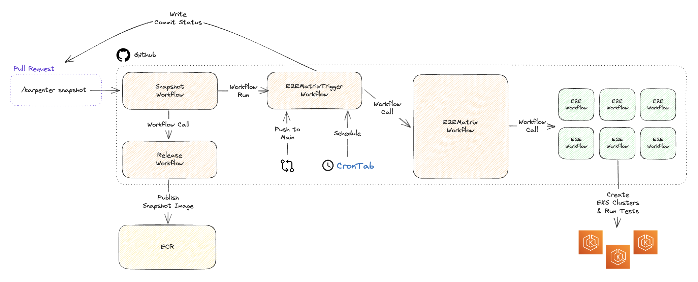

# E2E Testing

Karpenter leverages Github Actions to run our E2E test suites. These suites are triggered by:
1. Periodic schedule runs every 8 hours
2. New commits to the `main` branch
3. `/karpenter snapshot` review comments by maintainers on Pull Requests



## Directories
- `./.github/workflows`: Workflow files run within this repository. Relevant files for E2E testing are prefixed with `e2e-`
- `./.github/actions/e2e`: Composite actions utilized by the E2E workflows
- `./test/cloudformation`: Testing IAM Roles, Managed Prometheus Workspace, Managed Grafana Workspace
- `./test/suites`: Directories defining test suites
- `./test/pkg`: Common utilities and expectations
- `./test/hack`: Testing scripts

## Enabling Github Action Runs in Your AWS Account

1. Deploy the [Cloudformation stacks](https://github.com/aws/karpenter-provider-aws/tree/main/test/cloudformation/README.md) into your account to enable Managed Prometheus, Managed Grafana, and the Github Actions runner policies.
2. Set the following [Github Actions environment variables](https://docs.github.com/en/actions/learn-github-actions/variables#defining-configuration-variables-for-multiple-workflows) in your repository fork under `Settings/Secrets and Variables/Actions`:
   ```yaml
   AWS_REGION: <region>
   ACCOUNT_ID: <account-id>
   ROLE_NAME: <github-actions-role-name>
   PROMETHEUS_REGION: <managed-prometheus-hosted-region>
   TIMESTREAM_REGION: <timestream-hosted-region>
   WORKSPACE_ID: <managed-prometheus-workspace-id>
   ```
3. Trigger a `workflow_dispatch` event against the branch with your workflow changes to run the tests in GHA.
4. [Optional] Update the `SLACK_WEBHOOK_URL` secret to reference a custom slack webhook url for publishing build notification messages into your build notification slack channel.